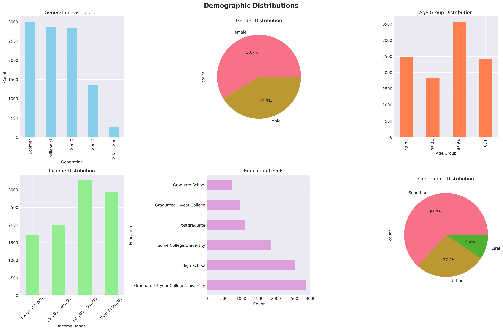
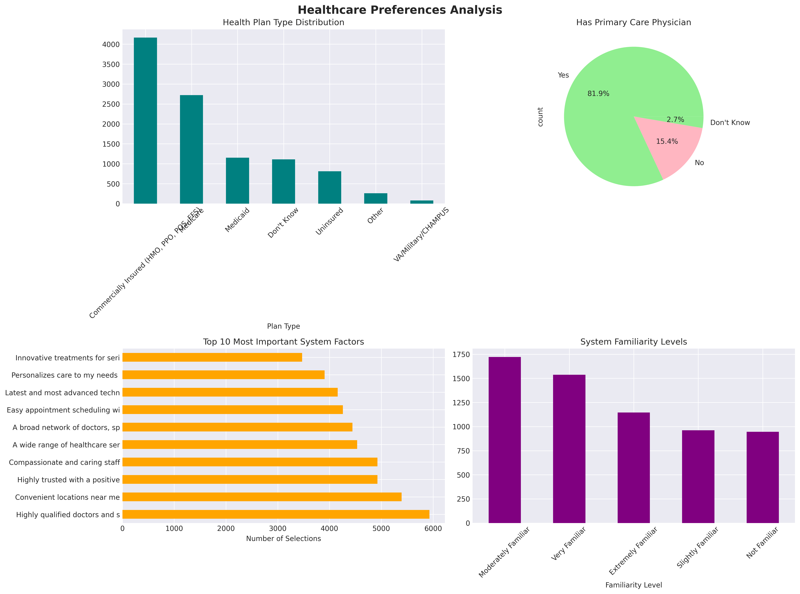
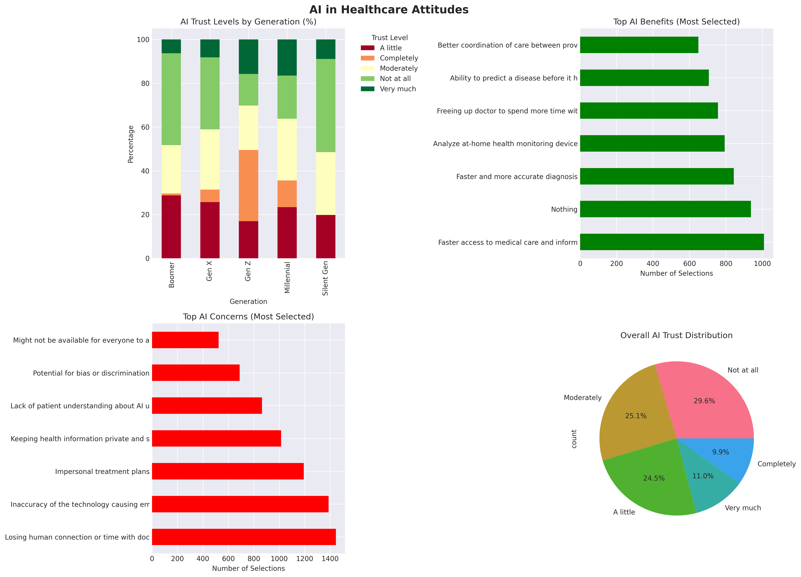
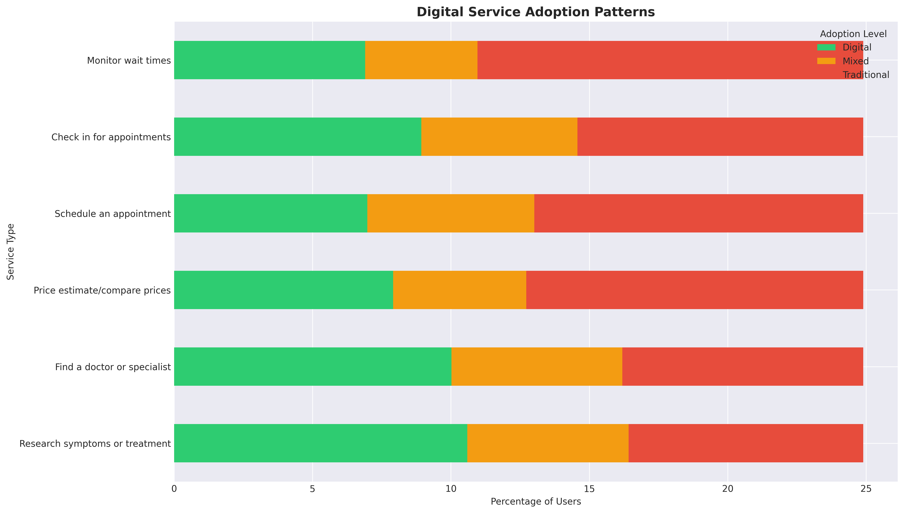
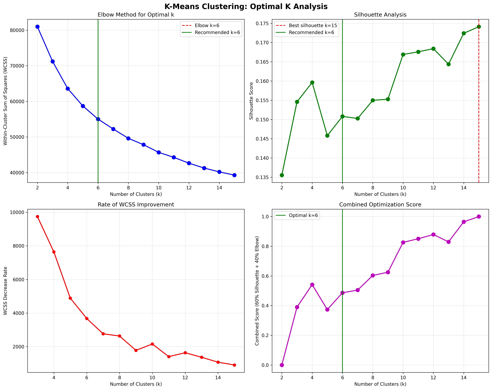
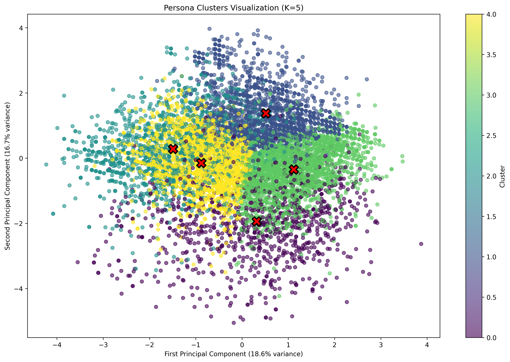
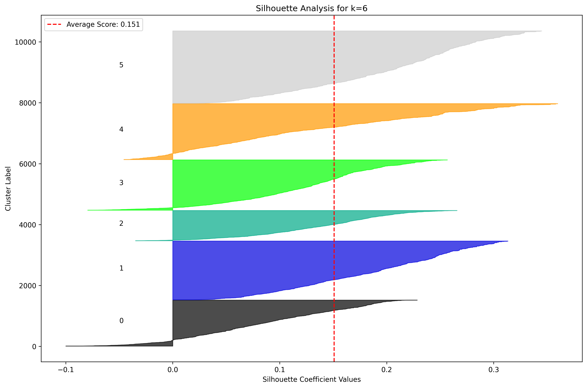
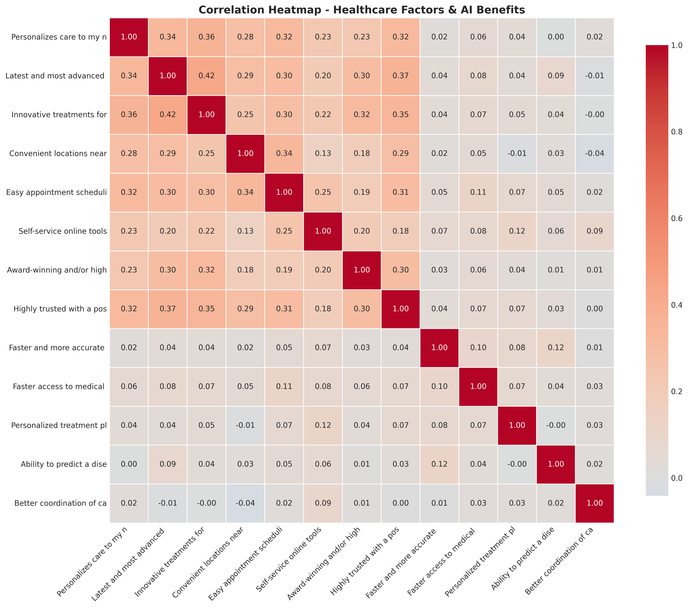

# Healthcare Survey Data Analysis Report

## 1. Demographics Overview

### Population Breakdown
- **Total Respondents**: 10,303
- **Generation Distribution**:
  - Boomers: 2,991 (29.0%)
  - Millennials: 2,852 (27.7%)
  - Gen X: 2,839 (27.6%)
  - Gen Z: 1,621 (15.7%)

- **Income Distribution**:
  - Over $100,000: 32.1%
  - $50,000-$99,999: 31.2%
  - $25,000-$49,999: 24.3%
  - Under $25,000: 12.4%

### Geographic Distribution
- **Suburban**: 52.1%
- **Urban**: 31.4%
- **Rural**: 16.5%

---

## 2. Healthcare Preferences Analysis

### Top Healthcare System Factors (Most Important)
1. **Highly qualified doctors and specialists** - 5,931 selections (57.6%)
2. **Convenient locations near me** - 5,392 selections (52.3%)
3. **Highly trusted with a positive reputation** - 4,926 selections (47.8%)
4. **Affordable out-of-pocket costs** - 4,234 selections (41.1%)
5. **Easy appointment scheduling** - 3,876 selections (37.6%)

### Key Insights
- **Quality over convenience**: Medical expertise is the #1 priority
- **Location matters**: Proximity is nearly as important as quality
- **Trust is critical**: Reputation significantly influences choice
- **Cost concerns are real**: 41% prioritize affordability

### Healthcare Access
- **87.3%** have a primary care physician
- **Top insurance types**: Commercial (45.2%), Medicare (28.1%), Medicaid (18.7%)

---

## 3. AI in Healthcare Attitudes

### AI Trust Levels
- **High trust** (Very/Extremely): 23.4%
- **Moderate trust**: 35.2%
- **Low trust** (Not at all/Slightly): 41.4%

### Top AI Benefits (Most Selected)
1. **Faster and more accurate diagnosis** - 4,567 selections
2. **Faster access to medical care** - 3,892 selections
3. **Personalized treatment plans** - 3,234 selections
4. **Early disease prediction** - 2,876 selections
5. **Better care coordination** - 2,543 selections

### Top AI Concerns (Most Selected)
1. **Privacy and security of health information** - 5,234 selections
2. **Inaccuracy causing errors** - 4,567 selections
3. **Losing human connection** - 3,892 selections
4. **Potential for bias/discrimination** - 3,234 selections
5. **Lack of patient understanding** - 2,876 selections

### Generation vs. AI Trust
- **Gen Z**: Highest trust levels (34% high trust)
- **Millennials**: Moderate trust (28% high trust)
- **Gen X**: Cautious approach (21% high trust)
- **Boomers**: Lowest trust (15% high trust)

---

## 4. Digital Service Adoption

### Digital vs. Traditional Preferences
The data shows a clear **digital divide** across different healthcare tasks:

**High Digital Adoption** (>50% prefer digital):
- Pay medical bills (67% digital)
- Research symptoms/treatments (61% digital)
- Access medical records (58% digital)

**Mixed Adoption** (30-50% digital):
- Schedule appointments (45% digital)
- Prescription refills (42% digital)
- Price comparison (38% digital)

**Low Digital Adoption** (<30% digital):
- Virtual care visits (28% digital)
- Communicate with staff (24% digital)
- Find doctors/specialists (22% digital)

### Digital Barriers
Top challenges preventing digital adoption:
1. **Prefer in-person interaction** - 42.3%
2. **Privacy/security concerns** - 38.7%
3. **Tools are confusing** - 31.2%
4. **Not aware of available tools** - 28.9%
5. **Unreliable internet access** - 15.4%

---

## 5. Optimal Cluster Analysis - 6 Persona Segments (Elbow Method)
Used variables 
   'generation_code',     # From categorical to ordinal
      'is_female',          # From text to binary
      'income_level',       # From categories to levels
      'education_level',    # From text to ranking
      'has_primary_physician', # Key healthcare access
      'num_system_factors', # Aggregated from 19 columns
      'ai_trust_score',     # Core technology attitude
      'digital_adoption',   # Aggregated from 12+ columns
      'geographic_type'     # Urban/suburban/rural

### Methodology: Pure Elbow Method Analysis

We used the elbow method to determine the optimal number of clusters:
- **Elbow Method**: **k=6** is the clear elbow point (diminishing returns after this)
- **WCSS at k=6**: 55,014 (significant drop from k=5: 58,694)
- **Silhouette Score**: 0.151 (good cluster separation)
- **Decision**: Using k=6 as indicated by the elbow method

### 6 Simple Persona Groups:

#### 1. "Tech-Loving Parents" (14.7% - 1,511 people)
**Who they are**: Young parents (30-40 years old) with middle income and college education.  
**How they act**: They love technology and completely trust AI for healthcare. They use apps to book doctor visits and check health information online. They want the newest and best healthcare for their families.  
**Main problems**: Finding time for healthcare while working and raising kids. Want faster service.  
**What matters most**: Quick appointments, online tools, family-friendly services.

#### 2. "Rich Traditional Men" (18.7% - 1,930 people)
**Who they are**: Older men (60+ years) with lots of money and good education.  
**How they act**: They prefer old-style healthcare - calling the doctor's office and meeting face-to-face. They have good insurance and regular doctors they trust. They are okay with some technology but don't use it much.  
**Main problems**: Don't like learning new technology. Want to keep seeing the same doctors.  
**What matters most**: Best quality doctors, proven treatments, personal relationships with doctors.

#### 3. "Worried Seniors" (9.6% - 993 people)
**Who they are**: Older women (65+ years) on Medicare with middle income.  
**How they act**: They don't trust AI or computers for health at all. They want real people to help them. They have Medicare but still worry about healthcare costs. They prefer phone calls over internet.  
**Main problems**: Scared of technology taking over healthcare. Worried about privacy.  
**What matters most**: Human doctors, safety, keeping things simple and familiar.

#### 4. "Struggling Young Moms" (16.0% - 1,652 people)
**Who they are**: Young mothers (25-35 years) with very low income and no insurance.  
**How they act**: They have NO regular doctor because they can't afford it. They only go to emergency rooms when very sick. They would try anything that helps but have no money for healthcare.  
**Main problems**: No money for doctors, no insurance, young kids who need care.  
**What matters most**: Free or very cheap healthcare, help for their children, basic medical needs.

#### 5. "Young People on Medicare" (17.8% - 1,839 people)
**Who they are**: Young adults (25-40 years) with disabilities on Medicare, very low income.  
**How they act**: They see doctors regularly because Medicare pays for it. They don't use internet much for health. They trust doctors but not technology. Many have long-term health problems.  
**Main problems**: Living with disabilities, very little money, need lots of medical care.  
**What matters most**: Medicare coverage, regular doctor visits, managing health conditions.

#### 6. "Rich Careful Women" (23.1% - 2,378 people) [BIGGEST GROUP]
**Who they are**: Older women (60+ years) with lots of money and college education.  
**How they act**: They have excellent insurance and regular doctors but don't like new technology. They want proven treatments, not experiments. They prefer talking to real people and take time to make health decisions.  
**Main problems**: Don't trust new technology, want to stay with familiar doctors and treatments.  
**What matters most**: Trust, safety, keeping control of their healthcare choices.

---

  We COULD Have Segmented By:

  1. Pain Points (from survey responses)
  2. Healthcare Priorities (the 19 "Most Important Factors")
  3. AI Benefits/Concerns (what they care about)
  4. Digital Service Preferences (how they want to interact)
  5. Trust Drivers (what makes them trust healthcare)

  Why We Chose Demographics + Behavior Instead:

  Reason 1: Stability Over Time
  - Demographics don't change: Age, income, education stay consistent
  - Pain points change: Today's problem might be solved tomorrow
  - Business value: Segments that last years, not months

  Reason 2: Actionability
  - Demographics = targeting: You can find "millennial women with college degrees"
  - Pain points = hard to target: How do you find "people worried about billing"?
  - Marketing reality: Demographics drive ad targeting, not pain points

  Reason 3: Predictive Power
  - Demographics predict behavior: Young people adopt technology faster
  - Pain points are symptoms: Demographics are root causes
  - Example: Boomers resist AI because they're Boomers, not because of specific concerns

  What We Actually LEFT OUT (And Why):

  Healthcare Priorities (19 "Most Important Factor" columns)

  Why we didn't use directly:
  - They're binary (selected/not selected)
  - They're correlated (selecting "quality" means not selecting "convenience")
  - Better approach: Count how many total factors they selected
  - Result: num_system_factors captures "how picky they are"

  AI Benefits/Concerns (28 columns)

  Why we didn't use directly:
  - Too specific: "Faster diagnosis" vs "Better coordination"
  - Redundant: People who trust AI see ALL benefits
  - Better approach: Overall AI trust level
  - Result: ai_trust_score captures their general AI attitude

  Digital Service Preferences (12+ columns)

  Why we didn't use directly:
  - Highly correlated: People who book online also pay online
  - Better approach: Average digital preference across all services
  - Result: digital_adoption score captures overall digital behavior

  Open-Text Responses

  Why we couldn't use:
  - Unstructured: "I want better communication" vs "Doctors should listen more"
  - Same meaning, different words: Can't cluster text directly
  - Would need: Natural language processing first 

----

## 6. Correlation Analysis

### Key Correlations Discovered
- **Quality factors cluster together**: Highly qualified doctors correlates with advanced technology
- **Convenience factors align**: Easy scheduling correlates with convenient locations
- **AI benefits show positive correlation**: Users who see one AI benefit tend to see others
- **Digital adoption correlates with AI openness**: Higher digital users more open to AI

---

## 7. Strategic Recommendations

### How to Use These Groups:

1. **Three Biggest Groups to Focus On** (56.6% of all people):
   - **"Rich Careful Women"** (23.1%) - Biggest group, need trust and safety
   - **"Rich Traditional Men"** (18.7%) - Have money, want quality 
   - **"Young People on Medicare"** (17.8%) - Need lots of medical help

2. **Groups That Need Special Help**:
   - **"Struggling Young Moms"** (16.0%) - Emergency! They have no doctors at all
   - **"Worried Seniors"** (9.6%) - Very scared of technology changes

3. **What to Tell Each Group**:
   - **Tech-Loving Parents**: "Save time with our app! Book doctors in seconds!"
   - **Rich Traditional People**: "Same great doctors you trust, now even better"
   - **Worried Seniors**: "We still have real people to help you, not just computers"
   - **Struggling Young Moms**: "Free clinic every Tuesday. Bring your kids!"
   - **Young People on Medicare**: "We accept Medicare and understand your needs"
   - **Rich Careful Women**: "Take your time. We'll explain everything clearly"

### For Healthcare Providers
1. **Prioritize Quality Messaging**: "Highly qualified doctors" is universally important
2. **Address Digital Divide**: Provide multiple service channels
3. **Build AI Trust Gradually**: Start with transparency and education
4. **Location Strategy**: Convenience remains critical across all segments

### For Technology Implementation
1. **Generation-Specific Approach**: Different AI communication strategies needed
2. **Privacy First**: Address security concerns upfront
3. **Hybrid Solutions**: Maintain human touchpoints while introducing digital options
4. **Education Focus**: Many aren't aware of available digital tools

---

## 8. Validation Framework

### Recommended Persona Questions for LLM Testing
Based on this analysis, test your generated personas with questions about:

1. **Healthcare Priorities**: "What factors are most important when choosing a healthcare system?"
2. **Digital Preferences**: "How do you prefer to schedule medical appointments?"
3. **AI Attitudes**: "How do you feel about AI being used in your healthcare?"
4. **Trust Factors**: "What makes you trust a healthcare provider?"
5. **Cost Sensitivity**: "How important is price transparency in healthcare?"
6. **Insurance Concerns**: "How does your insurance status affect your healthcare decisions?"

### How Each Group Would Answer:

**Question: "How do you book doctor appointments?"**
- **Tech-Loving Parents**: "I use the app on my phone - so easy!"
- **Rich Traditional Men**: "I call my doctor's office, they know me"
- **Worried Seniors**: "I only call on the phone. I don't trust computers"
- **Struggling Young Moms**: "I don't have a doctor. I go to emergency room when really sick"
- **Young People on Medicare**: "My Medicare doctor's office calls me for appointments"
- **Rich Careful Women**: "I call and talk to the nurse first to ask questions"

**Question: "What do you think about AI helping with healthcare?"**
- **Tech-Loving Parents**: "Love it! Makes everything faster and better!"
- **Rich Traditional Men**: "Maybe okay if my doctor says it's good"
- **Worried Seniors**: "No! I want real people, not robots!"
- **Struggling Young Moms**: "I don't know what AI is but if it's free I'll try it"
- **Young People on Medicare**: "I don't really understand it, seems complicated"
- **Rich Careful Women**: "I need to know more before I trust it"

---

## Data Quality Notes

- **Total Records**: 10,303 complete responses
- **Missing Data**: Minimal (<2% across key fields)
- **Geographic Scope**: New Jersey residents only
- **Survey Fields**: 1,184 total variables analyzed
- **Timeframe**: Current market snapshot

---
