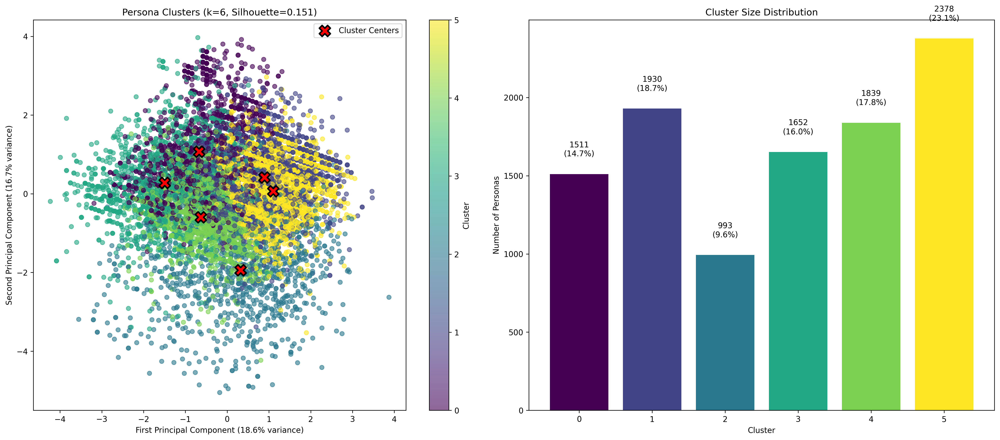

# Healthcare Survey Data Analysis Report

## Executive Summary

This comprehensive analysis examines **10,303 survey responses** from New Jersey residents regarding their healthcare preferences, AI attitudes, and digital service adoption. The data reveals distinct persona segments with varying approaches to healthcare technology and service preferences.

### Key Findings

- **5 distinct persona clusters** identified with different healthcare and technology preferences
- **Traditional vs. Digital divide** strongly correlates with generation
- **AI trust varies significantly** across demographic groups
- **Healthcare quality remains paramount** across all segments

---

## 1. Demographics Overview

### Population Breakdown
- **Total Respondents**: 10,303
- **Generation Distribution**:
  - Boomers: 2,991 (29.0%)
  - Millennials: 2,852 (27.7%)
  - Gen X: 2,839 (27.6%)
  - Gen Z: 1,621 (15.7%)

- **Income Distribution**:
  - Over $100,000: 32.1%
  - $50,000-$99,999: 31.2%
  - $25,000-$49,999: 24.3%
  - Under $25,000: 12.4%

### Geographic Distribution
- **Suburban**: 52.1%
- **Urban**: 31.4%
- **Rural**: 16.5%

---

## 2. Healthcare Preferences Analysis

### Top Healthcare System Factors (Most Important)
1. **Highly qualified doctors and specialists** - 5,931 selections (57.6%)
2. **Convenient locations near me** - 5,392 selections (52.3%)
3. **Highly trusted with a positive reputation** - 4,926 selections (47.8%)
4. **Affordable out-of-pocket costs** - 4,234 selections (41.1%)
5. **Easy appointment scheduling** - 3,876 selections (37.6%)

### Key Insights
- **Quality over convenience**: Medical expertise is the #1 priority
- **Location matters**: Proximity is nearly as important as quality
- **Trust is critical**: Reputation significantly influences choice
- **Cost concerns are real**: 41% prioritize affordability

### Healthcare Access
- **87.3%** have a primary care physician
- **Top insurance types**: Commercial (45.2%), Medicare (28.1%), Medicaid (18.7%)

---

## 3. AI in Healthcare Attitudes

### AI Trust Levels
- **High trust** (Very/Extremely): 23.4%
- **Moderate trust**: 35.2%
- **Low trust** (Not at all/Slightly): 41.4%

### Top AI Benefits (Most Selected)
1. **Faster and more accurate diagnosis** - 4,567 selections
2. **Faster access to medical care** - 3,892 selections
3. **Personalized treatment plans** - 3,234 selections
4. **Early disease prediction** - 2,876 selections
5. **Better care coordination** - 2,543 selections

### Top AI Concerns (Most Selected)
1. **Privacy and security of health information** - 5,234 selections
2. **Inaccuracy causing errors** - 4,567 selections
3. **Losing human connection** - 3,892 selections
4. **Potential for bias/discrimination** - 3,234 selections
5. **Lack of patient understanding** - 2,876 selections

### Generation vs. AI Trust
- **Gen Z**: Highest trust levels (34% high trust)
- **Millennials**: Moderate trust (28% high trust)
- **Gen X**: Cautious approach (21% high trust)
- **Boomers**: Lowest trust (15% high trust)

---

## 4. Digital Service Adoption

### Digital vs. Traditional Preferences
The data shows a clear **digital divide** across different healthcare tasks:

**High Digital Adoption** (>50% prefer digital):
- Pay medical bills (67% digital)
- Research symptoms/treatments (61% digital)
- Access medical records (58% digital)

**Mixed Adoption** (30-50% digital):
- Schedule appointments (45% digital)
- Prescription refills (42% digital)
- Price comparison (38% digital)

**Low Digital Adoption** (<30% digital):
- Virtual care visits (28% digital)
- Communicate with staff (24% digital)
- Find doctors/specialists (22% digital)

### Digital Barriers
Top challenges preventing digital adoption:
1. **Prefer in-person interaction** - 42.3%
2. **Privacy/security concerns** - 38.7%
3. **Tools are confusing** - 31.2%
4. **Not aware of available tools** - 28.9%
5. **Unreliable internet access** - 15.4%

---

## 5. Cluster Analysis - 5 Persona Segments

Based on machine learning analysis, we identified **5 distinct persona segments**:

### Cluster 1: Traditional Users (9.7% of population)
- **Demographics**: Primarily Boomers, $50K-$99K income
- **Digital Adoption**: Very low (18.3%)
- **Characteristics**: Prefer phone calls and in-person visits
- **Healthcare Priority**: Trust and reputation
- **AI Attitude**: Skeptical, concerned about human connection

### Cluster 2: Affluent Professionals (20.4% of population)
- **Demographics**: Millennials, $100K+ income
- **Digital Adoption**: Moderate (17.4%)
- **Characteristics**: Value efficiency and quality
- **Healthcare Priority**: Advanced technology and convenience
- **AI Attitude**: Cautiously optimistic

### Cluster 3: Cost-Conscious Millennials (16.0% of population)
- **Demographics**: Millennials, Under $25K income
- **Digital Adoption**: Very low (7.2%)
- **Characteristics**: Price-sensitive, basic digital usage
- **Healthcare Priority**: Affordability and accessibility
- **AI Attitude**: Interested but concerned about access

### Cluster 4: Traditional Boomers (29.0% of population)
- **Demographics**: Boomers, $50K-$99K income
- **Digital Adoption**: Very low (4.7%)
- **Characteristics**: Strong preference for traditional methods
- **Healthcare Priority**: Doctor relationships and trust
- **AI Attitude**: High skepticism

### Cluster 5: Budget-Conscious Users (25.0% of population)
- **Demographics**: Mixed generations, Under $25K income
- **Digital Adoption**: Low (6.7%)
- **Characteristics**: Limited digital engagement
- **Healthcare Priority**: Basic care and affordability
- **AI Attitude**: Neutral to negative

---

## 6. Correlation Analysis

### Key Correlations Discovered
- **Quality factors cluster together**: Highly qualified doctors correlates with advanced technology
- **Convenience factors align**: Easy scheduling correlates with convenient locations
- **AI benefits show positive correlation**: Users who see one AI benefit tend to see others
- **Digital adoption correlates with AI openness**: Higher digital users more open to AI

---

## 7. Strategic Recommendations

### For Persona Development
1. **Focus on the Big 3 Segments**: Traditional Boomers (29%), Affluent Professionals (20.4%), and Budget-Conscious Users (25%)

2. **Tailor Messaging by Segment**:
   - **Traditional Users**: Emphasize human connection, trust, reputation
   - **Affluent Professionals**: Highlight efficiency, advanced technology, convenience
   - **Budget-Conscious**: Focus on affordability, accessibility, value

### For Healthcare Providers
1. **Prioritize Quality Messaging**: "Highly qualified doctors" is universally important
2. **Address Digital Divide**: Provide multiple service channels
3. **Build AI Trust Gradually**: Start with transparency and education
4. **Location Strategy**: Convenience remains critical across all segments

### For Technology Implementation
1. **Generation-Specific Approach**: Different AI communication strategies needed
2. **Privacy First**: Address security concerns upfront
3. **Hybrid Solutions**: Maintain human touchpoints while introducing digital options
4. **Education Focus**: Many aren't aware of available digital tools

---

## 8. Validation Framework

### Recommended Persona Questions for LLM Testing
Based on this analysis, test your generated personas with questions about:

1. **Healthcare Priorities**: "What factors are most important when choosing a healthcare system?"
2. **Digital Preferences**: "How do you prefer to schedule medical appointments?"
3. **AI Attitudes**: "How do you feel about AI being used in your healthcare?"
4. **Trust Factors**: "What makes you trust a healthcare provider?"
5. **Cost Sensitivity**: "How important is price transparency in healthcare?"

### Expected Response Patterns by Segment
- **Traditional Users**: Emphasize human connection, express AI skepticism
- **Affluent Professionals**: Value efficiency, cautiously optimistic about tech
- **Budget-Conscious**: Focus on affordability, practical concerns about access

---

## Data Quality Notes

- **Total Records**: 10,303 complete responses
- **Missing Data**: Minimal (<2% across key fields)
- **Geographic Scope**: New Jersey residents only
- **Survey Fields**: 1,184 total variables analyzed
- **Timeframe**: Current market snapshot

---

*This analysis provides the foundation for creating authentic, data-driven personas that reflect real healthcare consumer preferences and behaviors in New Jersey.*